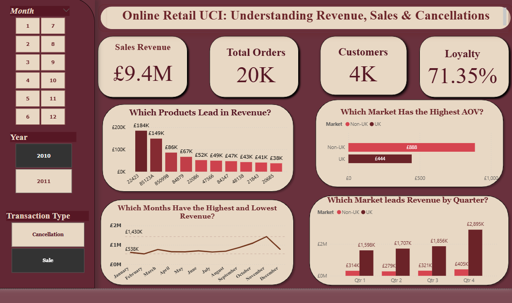
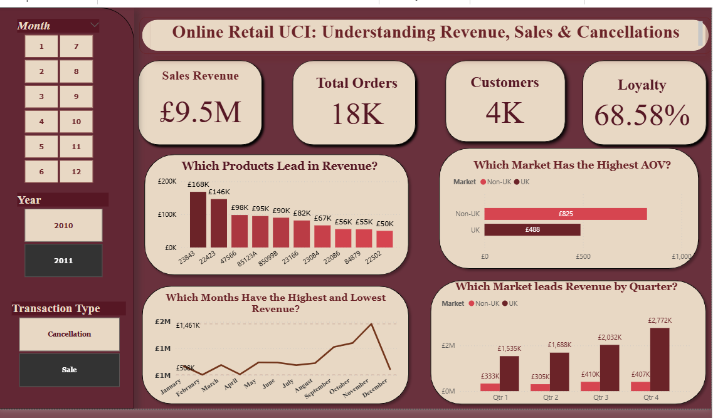
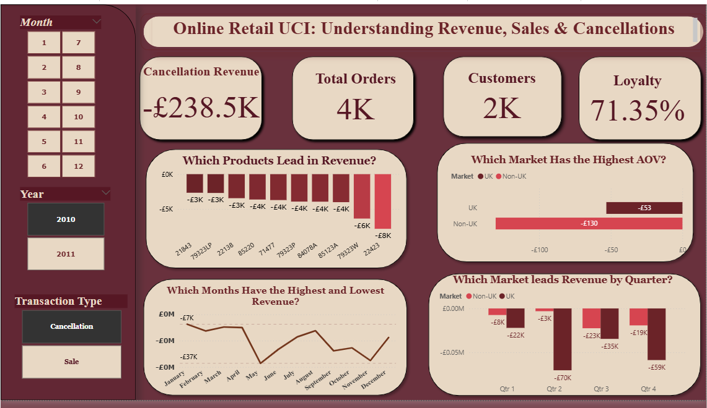
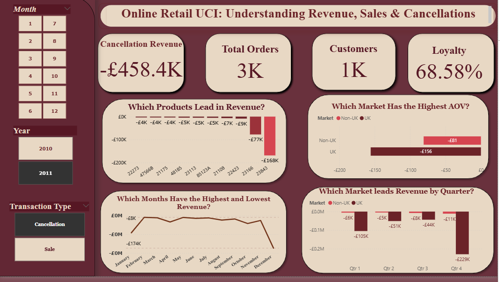

# UCI Online Retail II Performance Analysis
**Understanding Revenue, Sales & Cancellation Risk (2010–2011)**

## Executive Summary

Using MySQL and Power BI, I analyzed 2010–2011 online retail transactions to uncover revenue drivers, product performance, cancellation risk, and seasonal demand patterns. Revenue rose by £0.1M in 2011 despite roughly 2,000 fewer orders, driven by a rise in UK average order value. Cancellation impact nearly doubled year-over-year, concentrated in two high-value products, while a clear August–November seasonal peak highlights which products should be prioritized for stock ahead of the 2012 season.


### Top 3 Priorities

1. **Prepare inventory for the August–November sales surge** by prioritizing high-demand products and monitoring promising new products.

2. **Investigate the decline in customer loyalty** alongside the sharp increase in cancellations to identify potential quality or fulfillment issues.

3. **Investigate the December 2011 order decline** to understand why order volume dropped despite higher UK AOV.

---

## Business Problem

The business needs to understand what is driving revenue performance and where sales value is being lost through order cancellations. Revenue increased in 2011 despite fewer total orders, while the value lost to cancellations grew significantly year-over-year. This analysis answers two questions:

1. What actually drove the revenue increase, given that order volume fell?
2. What is driving the sharp rise in cancellation impact, and is it a recurring risk or a one-off event?

---
### Technical Implementation

**SQL**

* Data cleaning, validation, and duplicate handling
* Window functions with `ROW_NUMBER()`
* CTEs, subqueries, `JOIN`, `GROUP BY`, and `HAVING`
* Product, cancellation, and time-based analysis

**Power BI & DAX**

* KPI creation and interactive dashboard development
* Dynamic filtering and Top-N product analysis
* DAX functions including `CALCULATE()`, `RANKX()`, `FILTER()`, and `DISTINCTCOUNT()`

---
## Methodology

- **MySQL**: data cleaning, validation, and initial business analysis (handling nulls, duplicate checks, cancellation flagging, aggregate validation).
- **Power BI**:  DAX measures, KPI cards, and interactive visualization with slicers for Month, Year, and Transaction Type (Sale / Cancellation).
<p align="center">
  
</p> 

**Key analysis areas:**
- Revenue & order trends (2010 vs 2011)
- Average order value (AOV) analysis, UK vs Non-UK
- Product-level performance (top revenue, top cancellations)
- Market performance (UK vs Non-UK, by quarter)
- Customer-level cancellation concentration
- Cancellation analysis: frequency vs. value

---
## Key Findings

| Metric | 2010 | 2011 | Change |
|---|---|---|---|
| Sales revenue (excl. cancellations) | £9.4M | £9.5M | +£0.1M |
| Total orders | ~20K | ~18K | -2K |
| Cancellation impact | -£238.5K | -£458.4K | +£219.9K (~92%) |
| UK AOV | £444 | £488 | +£44 |
| Non-UK AOV | £888 | £825 | -£63 |


## Dashboards & Analytics Deep Dive

> **Note for Reviewers:** Below are key snapshots comparing 2010 vs. 2011 performance. Click to expand and view the full visual breakdown.

<details>
<summary><b>Click here to view all 4 Dashboard Screenshots (Sales & Cancellations 2010–2011)</b></summary>

<br>

#### Sales Performance (2010 vs 2011)



#### Cancellation & Risk Analysis (2010 vs 2011)



</details>
---

### Key Business Insights

* **Revenue remained resilient despite fewer orders**, supported by a rising UK AOV.
* **Two products drove most cancellation value**, including one exceptional £168K single-order cancellation.
* Identified a **separate recurring cancellation pattern** affecting 108 customers across 167 orders, indicating a potential product issue.
* Found a clear **August–November seasonal peak**, with November strongest in both years and six products consistently ranking among the top performers.
* A new 2011 product, **23084**, quickly became a top seller with **487 orders from 325 customers**.
* **Customer loyalty declined in 2011**, particularly in December, alongside a significant increase in cancellations.
* **December 2011 orders fell sharply (2,000 → 816)** despite higher AOV; the underlying cause remains an area for further investigation.

---

## Recommendations

**1.Prepare inventory before Q4**

Increase stock coverage for historically high-demand products before August, with additional monitoring during October–November.

**2. Monitor new-product performance**

Create an early-warning system for newly introduced products that rapidly gain customers, orders, or revenue so inventory can be scaled quickly.

**3. Strengthen UK customer strategy**

The UK remains the core market and shows increasing AOV. Focus retention and promotional strategies on high-value UK customers.

**4. Investigate cancellation-driven customer loss**

The sharp increase in cancellations alongside declining loyalty warrants a review of order accuracy, product quality, fulfillment, and customer complaints.


Open Questions / Further Investigation
December 2011 order drop: Orders fell sharply (2,000 → 816, ~59%) despite a higher UK AOV (£490 → £600), resulting in a smaller but still notable revenue decline (£775.7K → £614.5K). November cancellations were checked and ruled out as insufficient to explain the drop. The cause is not yet identified — competitor pricing/promotions and broader market conditions are untested hypotheses that would require external data to confirm.

---

## Repo Structure

```
├── README.md
├── images/
│   ├── dashboard_sales_view.png
│   └── dashboard_cancellation_view.png
├── sql/
│   └── data_cleaning_and_validation.sql
├── powerbi/
│   └── online_retail_dashboard.pbix
└── data/
    └── UCI_online_retail_II.csv 
```

## Author

*Menna_Tarek*
